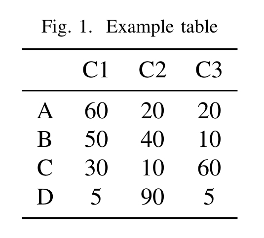
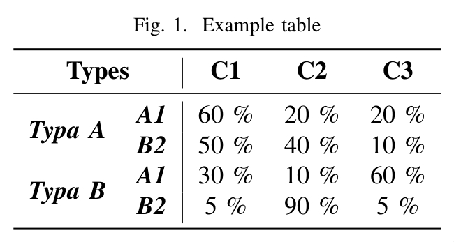

# etabs

Python library for building and rendering latex tables in an easy way.

## Instalation

```bash
pip install etabs
```

## Simple example

Code:
```python
from etabs import RuleType, TexTable

# Example values
values = [
    [60, 20, 20],
    [50, 40, 10],
    [30, 10, 60],
    [5, 90, 5],
]

row_labels = ["A", "B", "C", "D"]
col_labels = ["C1", "C2", "C3"]

# TexTabel is the main structure for creating tables
table = TexTable(centered=True, caption="Example table")

# Add rows
table.add_row(None, *col_labels) # First value empty, rest are column labels
for label, row in zip(row_labels, values):
    table.add_row(label, *row)

# You can optionally add rules at specific rows
table.add_rule(0, RuleType.TOP)
table.add_rule(1)  # By default, the rule is a midrule

# If no row is specified, it will be added at the end
table.add_rule(rule_type=RuleType.BOTTOM)

# Finally to get the latex code use the render method
print(table.render())
```

Output:
```latex
\begin{figure}[h!]
    \centering
    \caption{Example table}
    \vspace{0.5em}
    \begin{tabular}{cccc}
        \toprule
         & C1 & C2 & C3 \\
        \midrule
        A & 60 & 20 & 20 \\
        B & 50 & 40 & 10 \\
        C & 30 & 10 & 60 \\
        D & 5 & 90 & 5 \\
        \bottomrule
    \end{tabular}
\end{figure}
```

Result:

<p align="center"></p>

## A little more styled example

```python
from etabs import RuleType, TexTable

# Example values
values = [
    [60, 20, 20],
    [50, 40, 10],
    [30, 10, 60],
    [5, 90, 5],
]

col_labels = ["C1", "C2", "C3"]

table = TexTable(centered=True, caption="Example table")

# Add values
table.add_row(*col_labels, start=2)  # Colum 0 and 1 are empty
for row in values:
    # Preprocess each value to show as percentage
    table.add_row(*row, prep=lambda x: f"{x} \\%", start=2)

# Add a vertical separator before column 2
table.seps[2] = "|"

# Assign values directly
table[1, 1] = table[3, 1] = "A1"
table[2, 1] = table[4, 1] = "B2"

# Merge cells using slices
table[0, 0:2] = "Types"
table[1:3, 0] = "Typa A"
table[3:, 0] = "Typa B"

# Add some style using slices too
table[0, :].set_bold(True)
table[:, 0:2].set_bold(True)
table[1:, 0:2].set_italic(True)

# Add rules
table.add_rule(0, RuleType.TOP)
table.add_rule(1)
table.add_rule(rule_type=RuleType.BOTTOM)

print(table.render())
```

Output:
```latex
\begin{figure}[h!]
    \centering
    \caption{Example table}
    \vspace{0.5em}
    \begin{tabular}{cc|ccc}
        \toprule
        \multicolumn{2}{c|}{\textbf{Types}} & \textbf{C1} & \textbf{C2} & \textbf{C3} \\
        \midrule
        \multirow{2}{*}{\textit{\textbf{Typa A}}} & \textit{\textbf{A1}} & 60 \% & 20 \% & 20 \% \\
         & \textit{\textbf{B2}} & 50 \% & 40 \% & 10 \% \\
        \multirow{2}{*}{\textit{\textbf{Typa B}}} & \textit{\textbf{A1}} & 30 \% & 10 \% & 60 \% \\
         & \textit{\textbf{B2}} & 5 \% & 90 \% & 5 \% \\
        \bottomrule
    \end{tabular}
\end{figure}
```

Result:

<p align="center"></p>

